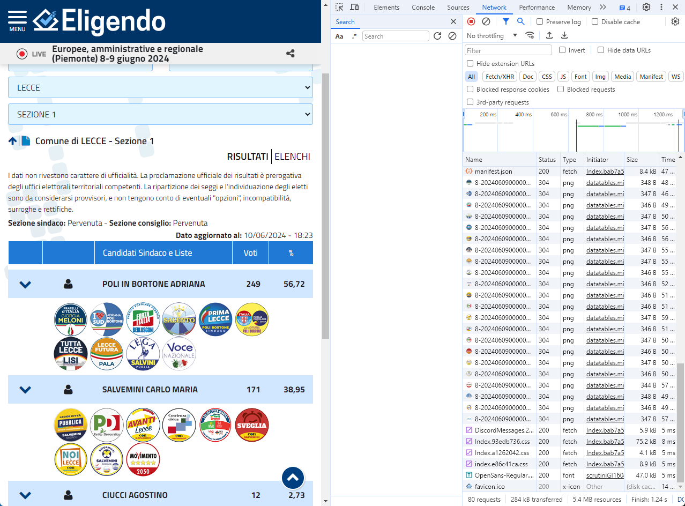
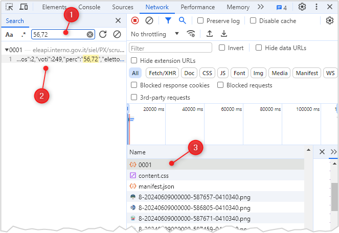
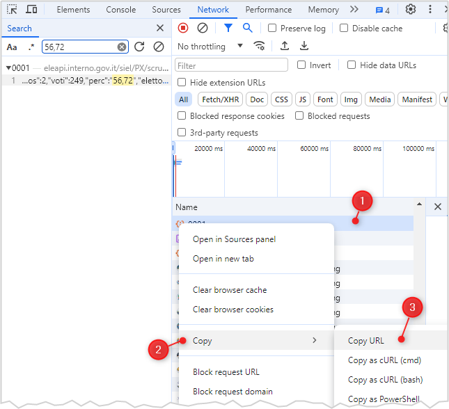

# Esempio estrazione dati dettaglio elezioni comunali

Si parte dall'analizzare una pagina web con questi dati, come quella della sezione `1` del Comune di Lecce:<br>
<https://elezioni.interno.gov.it/comunali/scrutini/20240609/scrutiniGI1604103400001>

È bene prima aprirla dopo avere aperto i *developer tools* del *browser*, per vedere come è fatta la pagina e come sono organizzati i dati.<br>
Nei *developer tools* tenere aperto il *Network* tab.



Poi c'è da capire **dove sono contenuti i dati**. Ad esempio il valore della percentuale di sopra, pari a `56,72` dove è contenuto?

Per scoprirlo c'è da fare un search come immagine sotto:

1. inserire il valore `56,72` e premere invio
2. fare click sul risultato trovato
3. questo mettere in evidenza la risorsa web che fornisce il dato cercato alla pagina



Non rimane che scoprire quale è l'URL di questa fonte dati. Basta aggiunge questi ultimi passaggi:

1. fare click col tasto destro sulla risorsa web trovata
2. fare click su `Copy`
3. fare click su `Copy URL`



In questo esempio l'URL è:<br>
`https://eleapi.interno.gov.it/siel/PX/scrutiniG/DE/20240609/TE/08/PR/041/CM/0340/SZ/0001`

Con un po' di esperienza nell'esplorare questo sito, nel leggere il codice HTML, nel leggere il traffico, si riconosce una chiamata strutturata in cui nell'URL si possono mappare questi campi:

- `PR/041` > codice provincia, `041`
- `CM/0340` > codice comune, `0340`
- `SZ/0001` > sezione, `0001`

Se la la sezione `1` ha il codice `0001`, la sezione `2` avrà il codice `0002`, e così via sino all'ultima che è la `0102` (si può leggere ed estrarre dal codice HTML).

## Download dati

La sorgente dati è un file `JSON` scaricabile in questo modo

```
curl --compressed 'https://eleapi.interno.gov.it/siel/PX/scrutiniG/DE/20240609/TE/08/PR/041/CM/0340/SZ/0001' \
-H 'User-Agent: Mozilla/5.0 (Windows NT 10.0; Win64; x64; rv:126.0) Gecko/20100101 Firefox/126.0' \
-H 'Accept: application/json, text/javascript, */*; q=0.01' \
-H 'Referer: https://elezioni.interno.gov.it/'
```

Quindi basta fara un ciclo da `0001` a `0102` per scaricare tutti i dati delle sezioni. Qui un esempio in bash:

```bash
for i in $(seq -w 0001 0102); do
    curl --compressed 'https://eleapi.interno.gov.it/siel/PX/scrutiniG/DE/20240609/TE/08/PR/041/CM/0340/SZ/'"$i"'' \
    -H 'User-Agent: Mozilla/5.0 (Windows NT 10.0; Win64; x64; rv:126.0) Gecko/20100101 Firefox/126.0' \
    -H 'Accept: application/json, text/javascript, */*; q=0.01' \
    -H 'Referer: https://elezioni.interno.gov.it/' > "$i".json
done
```

## Estrazione dati

Scaricati i 102 file `JSON` si può procedere con l'estrazione dei dati di proprio interesse.

È un `JSON`, quindi è elaborabile con qaulsiasi linguaggio di programmazione. Ma il passo necessario è leggerne la struttura, in modo da sapere come impostare l'estrazione dei dati.

Qui sotto una versione semplificata di un file `JSON` di una sezione:

- ci sono prima le informazioni generali della sezione
- poi l'`array`, l'elenco, dei candidati
- per ogni candidato c'è' l'`array`, l'elenco, delle liste

```json
{
  "int": {
    "cod_sez": 1,
    "desc_com": "LECCE",
    "cod_com": 340,
    "cod_prov": 41
  },
  "note": [
    "Non è previsto il dato retrospettivo a livello di sezione."
  ],
  "cand": [
    {
      "cogn": "POLI IN BORTONE",
      "l_nasc": "LECCE",
      "pos": 2,
      "tot_vot_lis": 227,
      "liste": [
        {
          "pos": 8,
          "descr_lista": "FRATELLI D'ITALIA",
          "img_lis": "8-20240609000000-587657-0410340.png",
          "voti": 46,
          "perc": "10,93",
          "seggi": null,
          "sort_lis": null
        },
        {
          "pos": 2,
          "descr_lista": "IO SUD",
          "img_lis": "8-20240609000000-586805-0410340.png",
          "voti": 44,
          "perc": "10,45",
          "seggi": null,
          "sort_lis": null
        }
      ]
    },
    {
      "cogn": "SALVEMINI",
      "l_nasc": "LECCE",
      "pos": 4,
      "tot_vot_lis": 185,
      "liste": [
        {
          "pos": 18,
          "descr_lista": "LECCE CITTA' PUBBLICA",
          "img_lis": "8-20240609000000-588443-0410340.png",
          "voti": 47,
          "perc": "11,16",
          "seggi": null,
          "sort_lis": null
        },
        {
          "pos": 19,
          "descr_lista": "PARTITO DEMOCRATICO",
          "img_lis": "8-20240609000000-588726-0410340.png",
          "voti": 43,
          "perc": "10,21",
          "seggi": null,
          "sort_lis": null
        }
      ]
    }
  ]
}
```

Un'*utility* molto comoda e documentata per estrarre dati da un `JSON` è [`jq`](https://jqlang.github.io/jq/). Disponibile per ogni sistema operativo.

Un formato d'estrazione comodo per le successive analisi è il `JSONLINE`, ovvero un file in cui ogni riga è un `JSON` valido.

Con `jq` ad esempio si può applicare al file JSON della prima sezione il seguente comando:

```bash
jq -c '
  . as $root |
  .cand[] as $cand |
  $cand.liste[] |
  {
    sez: $root.int.cod_sez,
    cod_prov: $root.int.cod_prov,
    cod_com: $root.int.cod_com,
    cogn: $cand.cogn,
    d_nasc: $cand.d_nasc,
    l_nasc: $cand.l_nasc,
    pos: $cand.pos,
    tot_vot_lis: $cand.tot_vot_lis,
    descr_lista: .descr_lista,
    voti: .voti
  }
' 0001.json > 0001.jsonl
```

Per ottenere (solo alcune righe):

```
{"sez":1,"cod_prov":41,"cod_com":340,"cogn":"POLI IN BORTONE","d_nasc":19430825000000,"l_nasc":"LECCE","pos":2,"tot_vot_lis":227,"descr_lista":"FRATELLI D'ITALIA","voti":46}
{"sez":1,"cod_prov":41,"cod_com":340,"cogn":"POLI IN BORTONE","d_nasc":19430825000000,"l_nasc":"LECCE","pos":2,"tot_vot_lis":227,"descr_lista":"IO SUD","voti":44}
{"sez":1,"cod_prov":41,"cod_com":340,"cogn":"POLI IN BORTONE","d_nasc":19430825000000,"l_nasc":"LECCE","pos":2,"tot_vot_lis":227,"descr_lista":"FORZA ITALIA - PPE","voti":23}
{"sez":1,"cod_prov":41,"cod_com":340,"cogn":"POLI IN BORTONE","d_nasc":19430825000000,"l_nasc":"LECCE","pos":2,"tot_vot_lis":227,"descr_lista":"MOVIMENTO REGIONE SALENTO","voti":22}
{"sez":1,"cod_prov":41,"cod_com":340,"cogn":"POLI IN BORTONE","d_nasc":19430825000000,"l_nasc":"LECCE","pos":2,"tot_vot_lis":227,"descr_lista":"PRIMA LECCE","voti":21}
{"sez":1,"cod_prov":41,"cod_com":340,"cogn":"POLI IN BORTONE","d_nasc":19430825000000,"l_nasc":"LECCE","pos":2,"tot_vot_lis":227,"descr_lista":"UNIONE DI CENTRO-PUGLIA POPOLARE LECCE","voti":21}
{"sez":1,"cod_prov":41,"cod_com":340,"cogn":"POLI IN BORTONE","d_nasc":19430825000000,"l_nasc":"LECCE","pos":2,"tot_vot_lis":227,"descr_lista":"TUTTA LECCE LISI","voti":20}
{"sez":1,"cod_prov":41,"cod_com":340,"cogn":"POLI IN BORTONE","d_nasc":19430825000000,"l_nasc":"LECCE","pos":2,"tot_vot_lis":227,"descr_lista":"LECCE FUTURA PALA","voti":18}
{"sez":1,"cod_prov":41,"cod_com":340,"cogn":"POLI IN BORTONE","d_nasc":19430825000000,"l_nasc":"LECCE","pos":2,"tot_vot_lis":227,"descr_lista":"LEGA SALVINI PUGLIA","voti":10}
```

Si può ottenere anche un `CSC` in output con `jq`:

```bash
jq -r '
  . as $root |
  .cand[] as $cand |
  $cand.liste[] |
  [
    $root.int.cod_sez,
    $root.int.cod_prov,
    $root.int.cod_com,
    $cand.cogn,
    $cand.d_nasc,
    $cand.l_nasc,
    $cand.pos,
    $cand.tot_vot_lis,
    .descr_lista,
    .voti
  ] | @csv
' 0001.json > 0001.csv
```

Che restituisce (solo alcune righe):

```
1,41,340,"POLI IN BORTONE",19430825000000,"LECCE",2,227,"FRATELLI D'ITALIA",46
1,41,340,"POLI IN BORTONE",19430825000000,"LECCE",2,227,"IO SUD",44
1,41,340,"POLI IN BORTONE",19430825000000,"LECCE",2,227,"FORZA ITALIA - PPE",23
1,41,340,"POLI IN BORTONE",19430825000000,"LECCE",2,227,"MOVIMENTO REGIONE SALENTO",22
1,41,340,"POLI IN BORTONE",19430825000000,"LECCE",2,227,"PRIMA LECCE",21
1,41,340,"POLI IN BORTONE",19430825000000,"LECCE",2,227,"UNIONE DI CENTRO-PUGLIA POPOLARE LECCE",21
1,41,340,"POLI IN BORTONE",19430825000000,"LECCE",2,227,"TUTTA LECCE LISI",20
1,41,340,"POLI IN BORTONE",19430825000000,"LECCE",2,227,"LECCE FUTURA PALA",18
1,41,340,"POLI IN BORTONE",19430825000000,"LECCE",2,227,"LEGA SALVINI PUGLIA",10
```

## Script di esempio

In questo [script bash](script/0410340.sh) è tutto messo insieme:

- prima il loop per scaricare i dati
- poi la creazione di un unico file `JSONLINE`
- poi la conversione, non necessaria, del `JSONLINE` in `CSV`

Le utility usate sono:

- `curl`
- `jq`
- [`mlr`](https://miller.readthedocs.io/en/6.12.0/) (che nello script è rinominato da `mlr` a `mlrgo`)

## Dati di output

In output:

- [`0410340.jsonl`](data/0410340.jsonl)
- [`0410340.csv`](data/0410340.csv)
